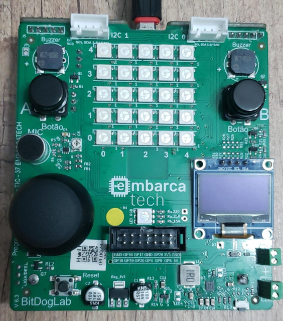

## EMBARCATECH - FAZE 2 ##
### *Challenge 1 - Virtual Galton Board*   (apr/2025)

---

### *Description:*

Make a Virtual Galton Board with BitDogLab.

Simulate a Galton Board on the BitDogLab's OLED display using a Digital Twin approach. This involves building a computational model that mirrors the behavior of the physical device, enabling visualization of the ball distribution at the bottom of the board and comparison with the theoretical normal distribution.

### *Techniques used in this project:*
* Multicore processing
* I2C communication
* OLED display interface 

### *Materials:*
Only the ***BitDogLab v.6.3***, developed by Prof.Dr. Fabiano Fruet (UNICAMP), was used.

---

