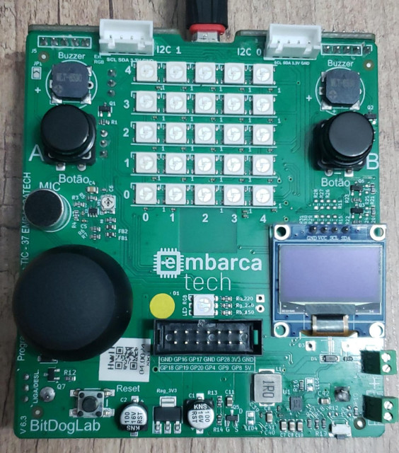

## EMBARCATECH - FAZE 2 ##
### *TESTE DE TESTE*   (mai/2025)

---

### *Description:*

Este exercício é uma introdução a biblioteca de testes unity.h
Para testar vou utilizar o [desafio Galton Board](../Desafio_01_Galton_Board) como o código que eu vou testar, por isso ele está repetido aqui.

### *Tecnologias neste exercício:*
* Teste unitário com unity.h

*Tecnologias do Desafio Galton Board*
* Multicore processing
* I2C communication
* OLED display interface 

### *Materials:*
Only the ***BitDogLab v.6.3***, developed by Prof.Dr. Fabiano Fruet (UNICAMP), was used.

---

